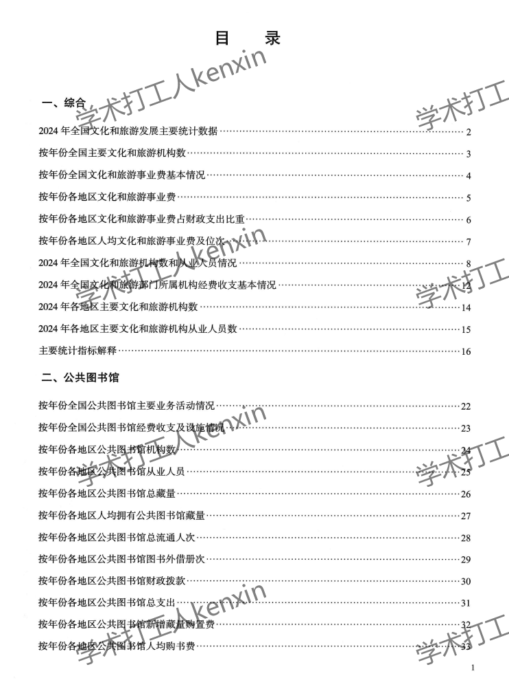
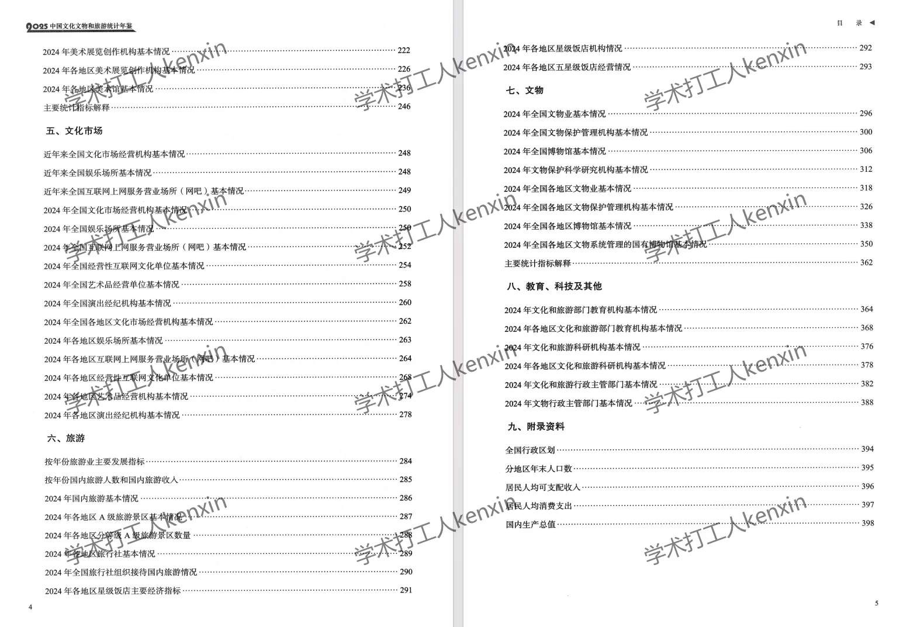
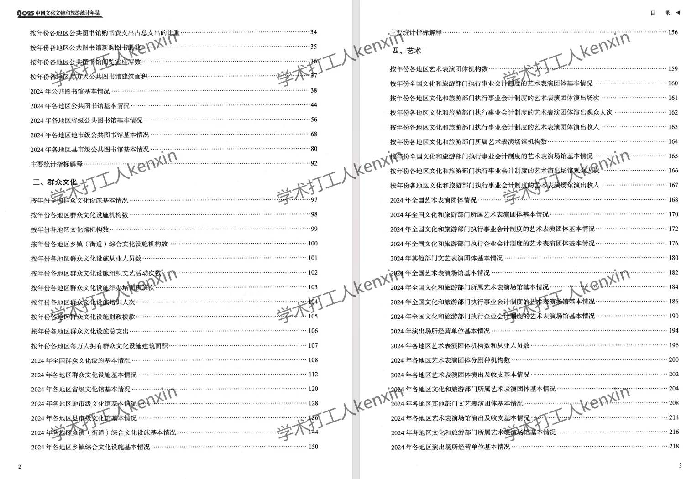
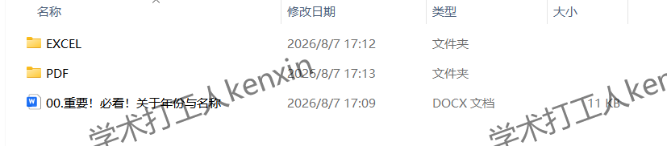

## Body

"China Cultural Relics and Tourism Statistical Yearbook" (1992-2025)

Year of Data: The yearbook covers the years from 1992 to 2025. To calculate the actual data year, subtract one from the year of the yearbook.

01. Data Introduction
The "China Tourism Statistical Yearbook" was renamed to "China Culture and Tourism Statistical Yearbook" in 2018, and then to "China Cultural Relics and Tourism Statistical Yearbook" in 2020.

02. Index Details
The directory is displayed in the picture for reference. Please purchase it on your own and do not help me find the data. There are many indicators here, and I cannot assist you in finding them without purchasing the product. After shipping, there is no return policy for unreasonable returns.
The display directory is for the year 2025, with a lot of content. For those who want to use search engines to understand the content beforehand, please do so. Different statistical years may have different standards. Academic knowledge is expected to be known.

03. Data Content
PDF and Excel versions are available, both as zipped files that need to be downloaded and unzipped first. The file location is shown in the picture. Please read it carefully before purchasing. If you are sensitive, please do not buy.

## Images

item_1073336361587

Here is a pay link on Stripe ( https://buy.stripe.com/3cs8yP7sY87d0vu9AB ). Please contact me lonlonago@foxmail.com after funding $89, and I will send you a complete data files , thank you!

